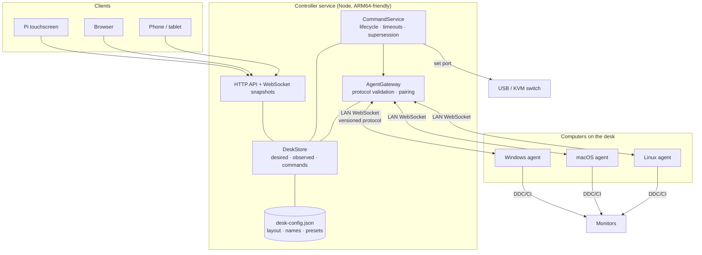
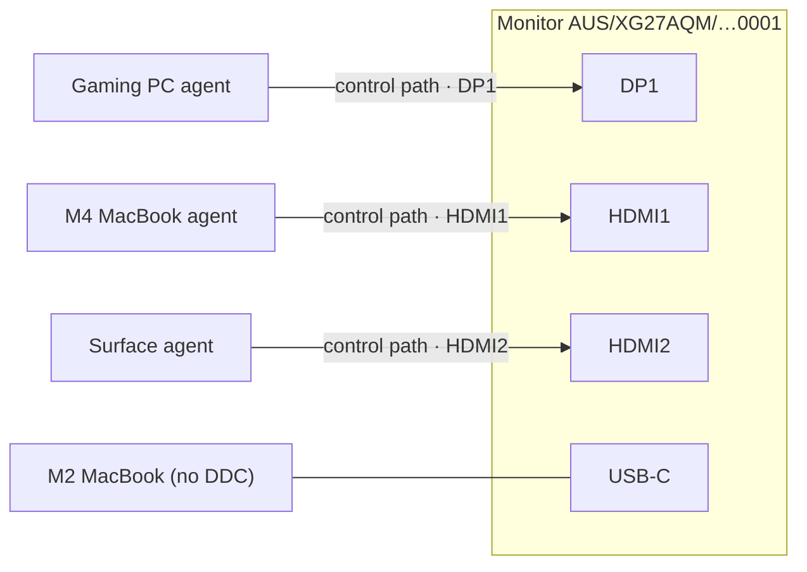
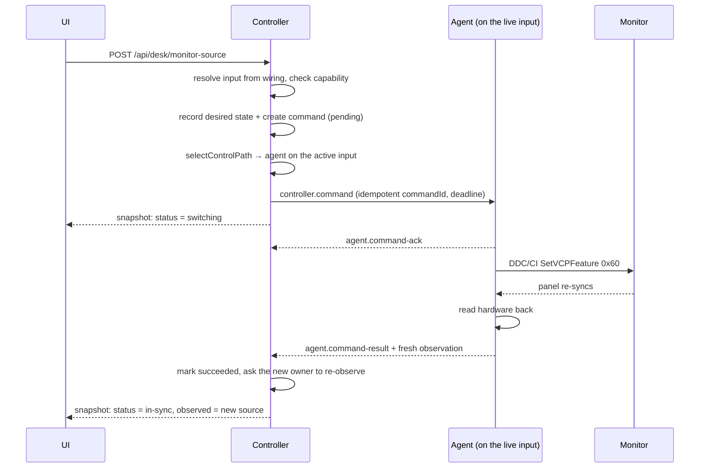
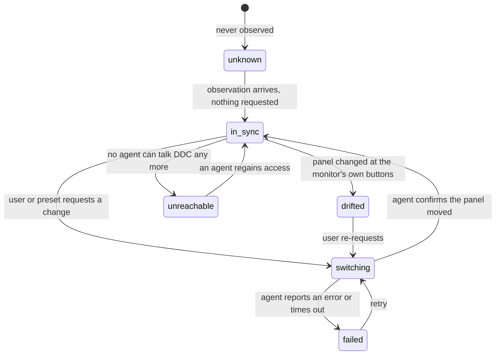

# Architecture

## The one-sentence version

A controller service holds the desired state of a desk, agents running on each computer report the
observed state of the hardware they can physically reach, and the UI renders the gap between the
two.

## Components

What is deliberately _not_ on that diagram: any video path, and any HID path. See
[hardware.md](hardware.md).

## Why agents dial the controller

One well-known service to find beats N agents to discover. It needs no inbound ports on user
machines, survives laptops joining and leaving the network, and keeps the trust decision in exactly
one place — the controller decides who may join. Discovery is therefore modelled as _the controller
advertises, agents browse_ (`ControllerAdvertiser` / `ControllerDiscovery` in
`@desk-control/discovery`).

## One monitor, several control paths

This is the least obvious part of the design and the part everything else hangs off.

A monitor on this kind of desk is cabled to several computers at once. Each agent that can see it
reports it under the same **EDID-derived stable id**, so the controller merges those reports into one
logical monitor with several _control paths_:

Two consequences:

1. **Wiring is discovered, not configured.** An agent knows which input its own cable occupies, so
   `connectedViaInputId` teaches the controller `computer → input` without the user typing anything.
   `wiringOverrides` in config exists for inputs no agent can ever report — a console, or a laptop
   with no agent installed.
2. **Only one agent can usually drive the switch.** Most monitors answer DDC/CI only on the input
   that is currently displayed. `selectControlPath()` therefore prefers the agent sitting on the live
   input, falls back to any online agent that does not need it, and otherwise refuses with
   `NO_CONTROL_PATH` rather than pretending.

## Command flow

The controller never writes an observation. An agent never reports the value it just asked for — it
reads the hardware back. If the read says the panel did not move, the UI says so.

## Desired vs observed

`drifted` is deliberately distinct from `failed`. Someone pressing the input button on the monitor
is not an error; it is information.

## State ownership

| State                                           | Lives in                     | Persisted?                             | Rebuilt from                |
| ----------------------------------------------- | ---------------------------- | -------------------------------------- | --------------------------- |
| Layout, custom names, presets, wiring overrides | `desk-config.json`           | Yes                                    | —                           |
| Monitors, inputs, capabilities, control paths   | Controller memory            | **No**                                 | Agent reports on every boot |
| Observed state                                  | Controller memory            | No                                     | Agent observations          |
| Desired state                                   | Controller memory            | Snapshot on shutdown, for display only | —                           |
| Commands                                        | Controller memory (last 100) | No                                     | —                           |

Hardware facts are never persisted, so swapping a monitor or re-cabling the desk cannot leave stale
truth behind. Desired state is saved on shutdown but **never re-applied on boot** — a controller
restart must not move your monitors underneath you.

## Deliberate deviations from the brief

**One `apps/agent`, not `apps/agent-windows` + `apps/agent-macos`.** Registration, heartbeats, command
handling, idempotency and reconnection are byte-for-byte identical on every platform; only the
`MonitorControlProvider` differs, and that is already a swappable interface in
`@desk-control/hardware`. Two apps would have duplicated the entire runtime to vary one constructor
argument. The platform split lives at `packages/hardware/src/platform/`, selected by
`--provider` or auto-detection.

**A dev-only `apps/mock-desk` hosting all mock agents in one process.** The monitors on a real desk
are _shared_ hardware. If each simulated agent owned a private simulated desk, a switch driven by one
agent would be invisible to the others and the DDC active-input constraint could not be modelled at
all. One process, one `SimulatedDesk`, N agent runtimes reproduces the real topology — and its
control API lets you stop individual agents and inject faults on demand.

**JSON, not SQLite.** Tens of entities of user intent, no query workload, no concurrent writer, and
the whole file is read into memory at boot anyway. JSON is hand-editable, diffable, trivially backed
up, and — for the ARM64 Pi target — has no native module to rebuild per Node ABI. `ConfigStore` is
the seam for the day we keep history (switch logs, usage over time), which is when SQLite starts
earning its keep.

## Extension points, in the order they will matter

1. `MonitorControlProvider` — Windows/macOS/Linux DDC. Nothing above it changes.
2. `PeripheralSwitchProvider` — real USB switch over GPIO, serial or USB-HID.
3. `ControllerDiscovery` / `ControllerAdvertiser` — mDNS for `_deskctl._tcp`.
4. `CommandPayload` — new verbs (brightness, power, wake) as new discriminated-union members.
5. Performance validation — `MonitorInput.maxMode` already records what each path can do; a planner
   can compare requested against preferred and warn before switching.
