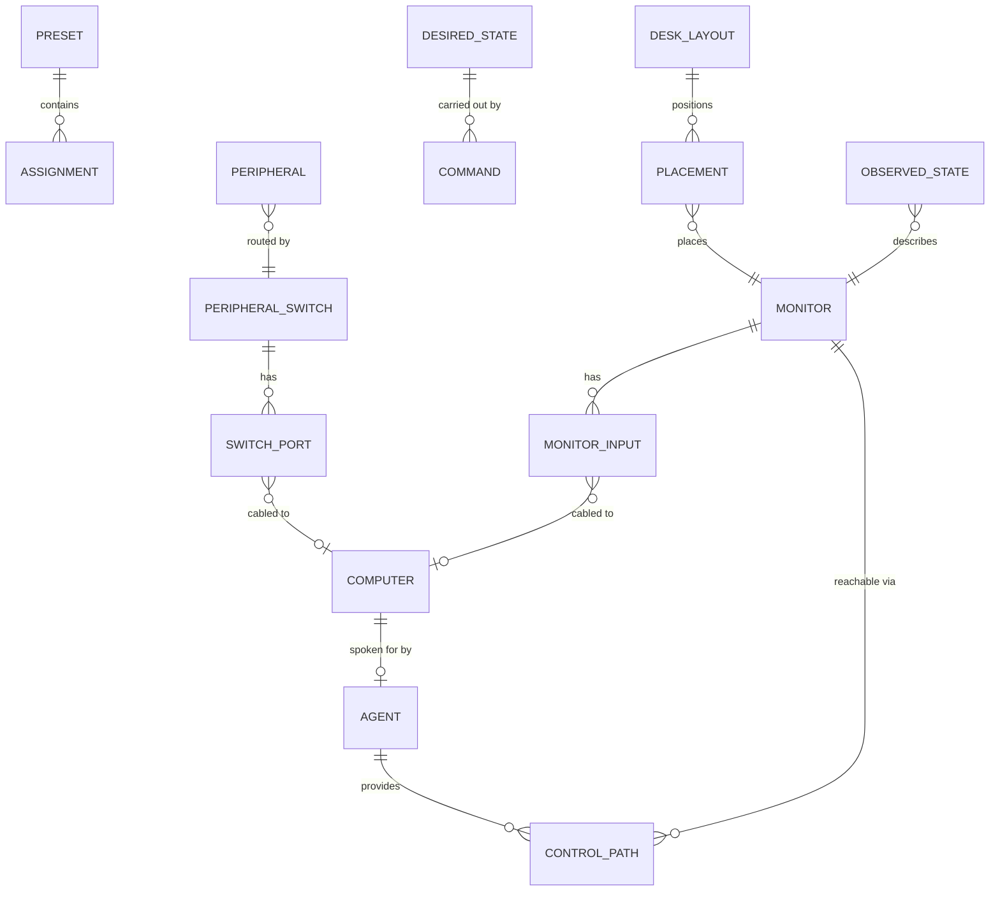

# Domain model

All types live in `@desk-control/domain` as Zod schemas with inferred TypeScript types. The package
has no I/O and no dependencies on the controller, agents or UI.

## Entities



| Type                             | What it is                                 | Notes                                                                                        |
| -------------------------------- | ------------------------------------------ | -------------------------------------------------------------------------------------------- |
| `Computer`                       | A source machine on the desk               | Exists whether or not an agent is running. A powered-off PC is still a valid routing target. |
| `Agent`                          | The _process_ speaking for a computer      | Modelled separately so restarts and upgrades don't delete the machine.                       |
| `Monitor`                        | A physical panel, identified by EDID       | Merged from every agent that can see it.                                                     |
| `MonitorInput`                   | One connector on a panel                   | Carries the vendor VCP value and which computer is cabled in.                                |
| `MonitorControlPath`             | How the controller can reach a monitor     | `agentId` + `inputId` + `requiresActiveInput`.                                               |
| `Peripheral`                     | A shared keyboard/mouse/etc.               | Owned by exactly one computer at a time.                                                     |
| `PeripheralSwitch`               | A hardware USB/KVM switch                  | Ports (one per computer) and channels.                                                       |
| `Preset`                         | Named assignments                          | Pure data. No behaviour, no special-casing.                                                  |
| `DeskLayout`                     | Where monitors sit, in abstract grid units | User configuration, kept separate from hardware.                                             |
| `Capability`                     | What a device can actually do              | The only thing core logic may branch on.                                                     |
| `DeskCommand`                    | One requested hardware change              | Has a lifecycle, a deadline and an idempotency key.                                          |
| `DesiredState` / `ObservedState` | Intent vs reality                          | Never merged.                                                                                |
| `DeskSnapshot`                   | Everything a UI client renders             | Includes server-computed resolutions.                                                        |

## Identity

Three rules, applied everywhere:

1. **Stable ids come from hardware**, never from a volatile OS index. `buildMonitorId()` derives
   `monitor:<mfr>:<model>:<serial>` from EDID; without a serial it falls back to a port-based
   disambiguator and sets `weakIdentity`.
2. **Detected names are presentation**, and may change with a driver update.
3. **Custom names never replace identity.**

```
displayName = customName ?? detectedName
```

Custom names are stored beside detected names in config, keyed by stable id. Re-detecting hardware
updates the detected name without losing the user's label, and renaming never touches a serial.

## Capabilities

```ts
type MonitorCapability =
  | 'input-switch'
  | 'brightness'
  | 'contrast'
  | 'power'
  | 'volume'
  | 'osd-lock'
  | 'read-active-input';

type ComputerCapability =
  | 'ddc-control'
  | 'wake-on-lan'
  | 'sleep'
  | 'power-off'
  | 'peripheral-switch-control'
  | 'report-active-display';

type PeripheralSwitchCapability = 'switch-port' | 'read-active-port' | 'per-peripheral-routing';
```

Capabilities from several control paths are **unioned**, not intersected: if any reachable agent can
switch inputs, the monitor can switch inputs. A missing capability produces a typed
`CAPABILITY_UNSUPPORTED` error, never a silent no-op.

The example desk deliberately includes variety — one monitor supports input switching only, one
computer can be a video source but cannot drive DDC — so capability handling is exercised rather than
assumed.

## Desired vs observed

Two separate structures, never merged:

```ts
DesiredState {
  monitorSources:   Record<MonitorId, { sourceComputerId, requestedAt, origin, commandId, presetId }>
  peripheralOwners: Record<PeripheralId, { ownerComputerId, ... }>
  activePresetId:   string | null
}

ObservedState {
  monitors:    Record<MonitorId, { activeInputId, activeSourceComputerId, powerState,
                                   reachability, observedAt, reportedByAgentId, lastError }>
  peripherals: Record<PeripheralId, { ownerComputerId, reachability, observedAt, lastError }>
}
```

`origin` (`user` | `preset` | `restore` | `startup`) records _why_ something was requested, which is
what lets the UI explain itself later.

`resolveMonitorState({ desired, observed, command })` is the single place where the two are compared:

| Status        | When                                                                                   |
| ------------- | -------------------------------------------------------------------------------------- |
| `unknown`     | Never observed. Do not guess.                                                          |
| `in-sync`     | Observed matches desired, or nothing was ever requested.                               |
| `switching`   | A command is in flight. Wins over everything — any observation we hold is known-stale. |
| `failed`      | The last command ended badly _and_ the hardware did not reach the target.              |
| `unreachable` | No agent can currently talk to the hardware.                                           |
| `drifted`     | Observed differs from desired with no command explaining it.                           |

Two subtleties worth keeping:

- A command that failed but whose target was reached anyway resolves to `in-sync`. Hardware wins over
  bookkeeping.
- `drifted` is not `failed`. Someone pressing the monitor's own input button is information, not an
  error.

## Sources without an agent

`MonitorInput.connectedComputerId` is a wiring fact, and discovery can only fill it in for inputs an
agent actually occupies. Everything else - a console, a laptop nobody installed anything on, a
machine that is simply switched off - is covered by two pieces of user config:

- `manualComputers` declares the machine, giving it a stable id (`computer:manual:<slug>`) and a
  platform. Its connectivity stays `unknown` rather than `offline`, because it was never expected to
  check in.
- `wiringOverrides` says which input it is plugged into, and always beats what discovery inferred.

Such a machine is then a first-class routing target. The switch is performed by whichever agent
holds DDC access to that monitor, so the declared machine never runs anything.

## Presets are data

A `Preset` is `{ monitorSources, peripheralOwners }` — two maps of ids. It has no code path of its
own.

`planPreset()` turns it into concrete intents against the _current_ hardware, resolving each
`monitor → computer` assignment to an actual input via discovered wiring. Assignments this desk
cannot satisfy become **skips** with reasons (`monitor-unknown`, `computer-not-wired`,
`peripheral-unknown`, `already-desired`), not failures: a preset written for a five-monitor desk
should still apply what it can on a four-monitor desk.

Applying a preset then calls exactly the same `setMonitorSource()` / `setPeripheralOwner()` methods
that a click on a single monitor calls. There is no second path.

`captureDeskState()` is the inverse: it turns the desk into assignments so a preset can be saved
from the UI. It reads **observed** state, not desired - "save this" means the arrangement you can
actually see, not the one that was last requested and may have failed. Anything currently
unreadable is left out and reported as skipped rather than baked in as a stale assumption.

## Performance model (designed, not yet enforced)

`MonitorInput.maxMode` records `{ width, height, refreshHz, vrr, bitDepth }` per input, and
`Monitor.preferredInputId` records the best path. Nothing consumes these yet — deliberately.

The intended use: before switching, compare the requested path's `maxMode` against the source's
preferred path and warn when routing would downgrade the user, e.g. _"HDMI 2 on this monitor is
1080p60 with no VRR; DisplayPort 1 is 1440p270 with VRR"_. The data model is in place so that
becomes a pure function over existing state rather than a schema migration.
