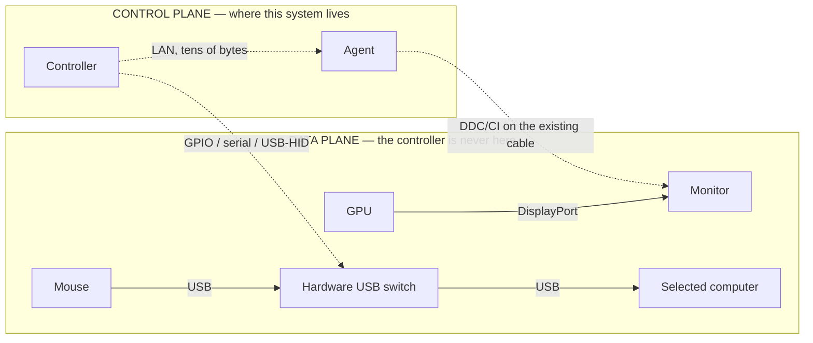

# Hardware

## Control plane, not data plane

This is the constraint every other decision in the system is subordinate to.



The controller tells a monitor _which input to select_. The pixels never touch it. The controller
tells a USB switch _which port to expose_. The HID reports never touch it.

### Why this is non-negotiable

A 1440p 270Hz VRR gaming signal is roughly 25 Gbit/s of strictly isochronous data. Any device
inserted into that path either drops the refresh rate, drops VRR, drops colour depth, or adds a frame
of latency — usually several of those. Software KVMs and network display protocols all pay this cost.

The input path is worse, because it is measured in human perception rather than bandwidth. A wired
mouse to a game is ~1 ms end to end. Proxying HID over even a perfect LAN adds jitter that a player
feels immediately and that no amount of engineering removes.

So the rule is absolute:

- **Never** proxy video through the Raspberry Pi, the controller, or the network.
- **Never** carry keyboard or mouse events over the control protocol.
- The worst possible failure of this entire system is _"the panel did not change input"_. It must
  never be _"my game stuttered"_.

### What follows from it

- **Fail passive.** The controller crashing, the Pi losing power, the network vanishing, an agent
  dying — none of these may change what is on screen or where the keyboard is pointed. There is no
  cleanup path, no "revert on disconnect", no heartbeat that releases hardware. Disconnect handling
  marks things offline and stops there.
- **The desk stays manually usable.** Every routing this system performs is one you could perform
  with the monitor's own buttons and the switch's own button. When the controller notices you did
  that, it reports `drifted` — not an error.
- **Latency of the control plane is irrelevant.** A switch takes 1–3 seconds because panels re-sync
  slowly. That is a UI problem (show `switching`), not an architecture problem.

## DDC/CI, honestly

Input switching uses DDC/CI: VCP feature `0x60` (Input Source) over the display data channel of the
cable that is already plugged in. It is a genuinely awkward protocol and the design accounts for its
awkwardness rather than wishing it away.

**Only the live input can usually talk.** Most monitors respond to DDC only on the input currently
being displayed. This is the single most important hardware fact in the system:

- After the gaming PC hands a monitor to the MacBook, the _gaming PC_ loses the ability to control
  that monitor, and the _MacBook_ gains it.
- The controller therefore tracks, per monitor, which agent is on the live input, and routes each
  command through that agent (`selectControlPath`).
- Right after a switch there is a brief window where nobody can read the panel: the old owner has
  lost access and the new owner has not polled yet. The controller handles this by (a) asking the new
  owner to observe immediately, and (b) keeping a separate `lastKnownActiveInput` belief used _only_
  for routing the next command — never for telling you what is on screen.

**Vendor VCP values differ.** `0x0f` for DisplayPort and `0x11` for HDMI are conventions, not
standards. Values belong to the `MonitorInput`, discovered per monitor; no core code may contain a
vendor table.

**Capabilities vary wildly.** One monitor does input + brightness + power; the one next to it does
input only. Everything is gated on reported capabilities (`Monitor.capabilities`), and a missing
capability produces `CAPABILITY_UNSUPPORTED` rather than a silent no-op.

**It is slow and it fails.** Round trips are tens to hundreds of milliseconds, panels re-sync for
seconds, and busy or asleep monitors simply do not answer. Every command carries a deadline; timeouts
are a normal outcome, not an exception.

## Monitor identity

An OS display index is not an identity. "Display 1" changes when you reboot, unplug something, or
update a driver — and two agents looking at the same panel see different indices.

Identity is derived from EDID: `manufacturerId + model + serial`. Two identical monitors on one desk
are the common case, which is exactly why the serial matters. When a monitor reports no serial the id
falls back to a port-based disambiguator and is flagged `weakIdentity`, so the UI can eventually ask
the user to confirm the mapping instead of silently guessing.

```
monitor:aus:xg27aqm:asus-xg27-0001    strong  (serial present)
monitor:aus:pa248qv:dp-2              weak    (no serial; port-derived)
```

The user's label is separate and never replaces identity: `displayName = customName ?? detectedName`.

EDID parsing is **not** implemented in this bootstrap. The simulator supplies identity facts
directly; real providers will parse EDID from SetupAPI/WMI (Windows), IODisplay (macOS) or
`/sys/class/drm/*/edid` (Linux).

## The provider interface

```ts
interface MonitorControlProvider {
  readonly kind: string;
  discoverMonitors(): Promise<MonitorReport[]>;
  getCapabilities(stableId: string): Promise<MonitorCapability[]>;
  getObservedState(): Promise<ObservedMonitorReport[]>;
  setInput(request: SetInputRequest): Promise<ProviderOperationResult>;
  dispose?(): Promise<void>;
}
```

Rules for every implementation, present and future:

1. `getObservedState()` reads hardware. It may never echo a value that was just written.
2. `setInput()` is idempotent on `commandId`. A redelivered command is answered from cache.
3. Unreachable is a first-class result, not an exception to swallow.
4. Nothing above this interface may branch on platform or vendor.

`MockMonitorControlProvider` is the reference implementation and models all four rules, including
losing reachability when its input is not live.

## Peripheral switching

Keyboard and mouse ownership moves by asking a **hardware** USB switch to change ports. The system
models one switch with ports (one per computer) and channels (a simple 4-port KVM has a single
channel, so keyboard and mouse move together — the model says so explicitly rather than pretending
they are independent).

Only `MockPeripheralSwitchProvider` exists today. Real implementations will drive a switch from the
controller host over GPIO, serial, or USB-HID — still control plane only.

## Recommended next milestone: Windows DDC/CI

The gaming PC is the machine that matters most (it owns the high-refresh path, and it holds the live
input at rest), and Windows has the most tractable API surface. A vertical slice for one real machine
is worth more than three half-finished platforms.

Scope:

1. **Enumerate + identify** — `EnumDisplayMonitors` → `GetPhysicalMonitorsFromHMONITOR`, EDID via
   SetupAPI or WMI (`WmiMonitorID`). Produce the same `stableId` the simulator produces.
2. **Capabilities** — `GetCapabilitiesStringLength` / `CapabilitiesRequestAndCapabilitiesReply`,
   parsing the VCP list for `60` and its supported values. Map those to `MonitorCapability`.
3. **Observe** — `GetVCPFeatureAndVCPFeatureReply(0x60)` for the active input; treat a failure as
   `unreachable`, never as "unchanged".
4. **Switch** — `SetVCPFeature(0x60, value)`, then re-read to confirm. Do not report success on the
   write alone.
5. **Bindings** — `koffi` or `ffi-napi` against `dxva2.dll`, or a small helper executable. Prefer
   whichever keeps the agent installable without a compiler.

Definition of done: run `apps/agent --provider windows-ddc` on the real gaming PC, see its real
monitors appear in the existing UI beside simulated ones, and switch a real panel from the browser
with the observed state confirmed by reading the hardware back.

Expect to discover: monitors that report a capability and then refuse it, vendor input values outside
the conventional set, and DDC calls that hang. All three are reasons the abstraction was built the
way it is.
