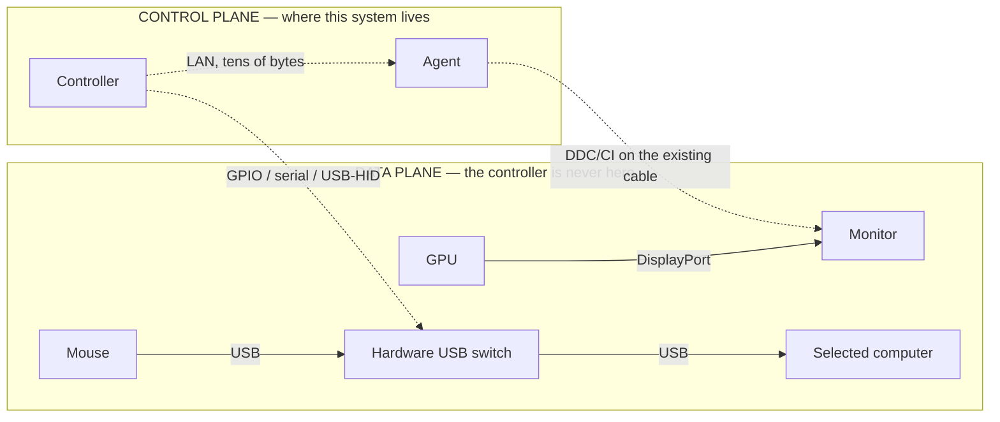

# Hardware

## Control plane, not data plane

This is the constraint every other decision in the system is subordinate to.



The controller tells a monitor _which input to select_. The pixels never touch it. The controller
tells a USB switch _which port to expose_. The HID reports never touch it.

### Why this is non-negotiable

A 1440p 270Hz VRR gaming signal is roughly 25 Gbit/s of strictly isochronous data. Any device
inserted into that path either drops the refresh rate, drops VRR, drops colour depth, or adds a frame
of latency — usually several of those. Software KVMs and network display protocols all pay this cost.

The input path is worse, because it is measured in human perception rather than bandwidth. A wired
mouse to a game is ~1 ms end to end. Proxying HID over even a perfect LAN adds jitter that a player
feels immediately and that no amount of engineering removes.

So the rule is absolute:

- **Never** proxy video through the Raspberry Pi, the controller, or the network.
- **Never** carry keyboard or mouse events over the control protocol.
- The worst possible failure of this entire system is _"the panel did not change input"_. It must
  never be _"my game stuttered"_.

### What follows from it

- **Fail passive.** The controller crashing, the Pi losing power, the network vanishing, an agent
  dying — none of these may change what is on screen or where the keyboard is pointed. There is no
  cleanup path, no "revert on disconnect", no heartbeat that releases hardware. Disconnect handling
  marks things offline and stops there.
- **The desk stays manually usable.** Every routing this system performs is one you could perform
  with the monitor's own buttons and the switch's own button. When the controller notices you did
  that, it reports `drifted` — not an error.
- **Latency of the control plane is irrelevant.** A switch takes 1–3 seconds because panels re-sync
  slowly. That is a UI problem (show `switching`), not an architecture problem.

## DDC/CI, honestly

Input switching uses DDC/CI: VCP feature `0x60` (Input Source) over the display data channel of the
cable that is already plugged in. It is a genuinely awkward protocol and the design accounts for its
awkwardness rather than wishing it away.

**Only the live input can usually talk.** Most monitors respond to DDC only on the input currently
being displayed. This is the single most important hardware fact in the system:

- After the gaming PC hands a monitor to the MacBook, the _gaming PC_ loses the ability to control
  that monitor, and the _MacBook_ gains it.
- The controller therefore tracks, per monitor, which agent is on the live input, and routes each
  command through that agent (`selectControlPath`).
- Right after a switch there is a brief window where nobody can read the panel: the old owner has
  lost access and the new owner has not polled yet. The controller handles this by (a) asking the new
  owner to observe immediately, and (b) keeping a separate `lastKnownActiveInput` belief used _only_
  for routing the next command — never for telling you what is on screen.

**Vendor VCP values differ.** `0x0f` for DisplayPort and `0x11` for HDMI are conventions, not
standards. Values belong to the `MonitorInput`, discovered per monitor; no core code may contain a
vendor table.

**Capabilities vary wildly.** One monitor does input + brightness + power; the one next to it does
input only. Everything is gated on reported capabilities (`Monitor.capabilities`), and a missing
capability produces `CAPABILITY_UNSUPPORTED` rather than a silent no-op.

**It is slow and it fails.** Round trips are tens to hundreds of milliseconds, panels re-sync for
seconds, and busy or asleep monitors simply do not answer. Every command carries a deadline; timeouts
are a normal outcome, not an exception.

## Monitor identity

An OS display index is not an identity. "Display 1" changes when you reboot, unplug something, or
update a driver — and two agents looking at the same panel see different indices.

Identity is derived from EDID: `manufacturerId + model + serial`. Two identical monitors on one desk
are the common case, which is exactly why the serial matters. When a monitor reports no serial the id
falls back to a port-based disambiguator and is flagged `weakIdentity`, so the UI can eventually ask
the user to confirm the mapping instead of silently guessing.

```
monitor:aus:xg27aqm:asus-xg27-0001    strong  (serial present)
monitor:aus:pa248qv:dp-2              weak    (no serial; port-derived)
```

The user's label is separate and never replaces identity: `displayName = customName ?? detectedName`.

EDID parsing is **not** implemented in this bootstrap. The simulator supplies identity facts
directly; real providers will parse EDID from SetupAPI/WMI (Windows), IODisplay (macOS) or
`/sys/class/drm/*/edid` (Linux).

## The provider interface

```ts
interface MonitorControlProvider {
  readonly kind: string;
  discoverMonitors(): Promise<MonitorReport[]>;
  getCapabilities(stableId: string): Promise<MonitorCapability[]>;
  getObservedState(): Promise<ObservedMonitorReport[]>;
  setInput(request: SetInputRequest): Promise<ProviderOperationResult>;
  dispose?(): Promise<void>;
}
```

Rules for every implementation, present and future:

1. `getObservedState()` reads hardware. It may never echo a value that was just written.
2. `setInput()` is idempotent on `commandId`. A redelivered command is answered from cache.
3. Unreachable is a first-class result, not an exception to swallow.
4. Nothing above this interface may branch on platform or vendor.

`MockMonitorControlProvider` is the reference implementation and models all four rules, including
losing reachability when its input is not live.

## Peripheral switching

Keyboard and mouse ownership moves by asking a **hardware** USB switch to change ports. The system
models one switch with ports (one per computer) and channels (a simple 4-port KVM has a single
channel, so keyboard and mouse move together — the model says so explicitly rather than pretending
they are independent).

Only `MockPeripheralSwitchProvider` exists today. Real implementations will drive a switch from the
controller host over GPIO, serial, or USB-HID — still control plane only.

## The Windows provider

Implemented and verified against real monitors.

**How it talks to hardware.** A long-lived `powershell.exe` process compiles a P/Invoke shim once at
startup, then speaks one JSON object per line: `list`, `observe`, `getvcp`, `setvcp`. Underneath it
is `EnumDisplayMonitors` → `GetPhysicalMonitorsFromHMONITOR` → the `dxva2.dll` VCP calls, with EDID
from WMI `WmiMonitorID`.

No native module, no compiler, no per-ABI prebuild, and nothing extra for ARM64. It also works
unchanged from WSL, since `powershell.exe` is reachable there — which is how it was developed against
a real desk.

**Measured on real hardware:** ~8 s for the first `discoverMonitors()` (PowerShell startup plus the
WMI query, paid once), ~120 ms for a warm `getObservedState()` across two monitors, ~550 ms for a
`setInput()` including read-back verification. Comfortable against a 3 s observation interval.

**Handles are never held across calls.** Physical monitor handles are invalidated by display topology
changes, so every operation re-enumerates and looks the panel up by its device interface path.

### Joining the two names Windows gives a monitor

EDID lives in WMI, DDC handles come from the display API, and they identify the same panel
differently:

```
WMI      DISPLAY\AUS276D\7&2d237c0c&0&UID16641_0
Windows  \\?\DISPLAY#AUS276D#7&2d237c0c&0&UID16641#{e6f07b5f-ee97-...}
```

Both normalise to `display\aus276d\7&2d237c0c&0&uid16641`, making the join exact rather than a guess
based on enumeration order — which matters the moment two identical monitors are on one desk.

The stable id is then derived from EDID alone (`AUS` + `PA278CV` + `N6LMQS137321`), never from an
adapter name or instance path, so a macOS agent looking at the same panel computes the same id and
the controller merges the two control paths.

### What real monitors actually did

Two ASUS panels on one desk, and they disagreed in ways worth recording:

- **Capability strings are not uniformly formatted.** One packs sections together
  (`(prot(monitor)type(LCD)model(PA278CV)...`), the other sprinkles spaces
  (`(prot(monitor) type(LCD)model(PA279CV) ...`). Both are parsed; neither is pattern-matched.
- **They advertise different input sets.** `60(11 0F 10)` on one, `60(11 12 0F)` on the other. The
  capabilities string is the only authority on which inputs exist.
- **The VCP type field is not trustworthy.** Reading 0x60 returned type `1` (set-parameter) on one
  panel and type `0` (momentary) on the other, for the same feature. Nothing branches on it, and the
  `max` value from a read is ignored for the same reason.
- **Both reported `Generic PnP Monitor`** as their description. Identity has to come from EDID.

This is precisely why the provider parses capabilities, gates on them, and confirms every write by
reading the panel back.

### Verifying a switch

`setInput()` writes VCP 0x60 and then re-reads until the deadline. Three outcomes:

| Read-back says                        | Result                | Why                                                                                                         |
| ------------------------------------- | --------------------- | ----------------------------------------------------------------------------------------------------------- |
| the target input                      | success, verified     | the panel moved                                                                                             |
| nothing — DDC stops answering         | success, unverified   | the normal signature of handing the panel to another computer: from this cable there is nothing left to ask |
| a different input, until the deadline | failure `DEVICE_BUSY` | the write was accepted and ignored, which some panels do                                                    |

The controller then asks the agent that just _gained_ the input to observe immediately, which is what
closes the gap in case two.

### Wiring inference, and its honest failure mode

VCP 0x60 reports the monitor's globally selected input, not "the input you are asking down". When a
panel answers at all it is almost always because it is displaying us, so the live input is taken to
be this machine's cable. A monitor that keeps DDC alive on an inactive input will mislead this guess.

That is what `wiringOverrides` in the desk config is for, and a user override always wins.

### Not covered by the Windows provider

Per-input mode data (`maxMode` stays `null` — DDC cannot report what a _different_ input would
negotiate), brightness/power/volume operations (the capabilities are detected but no command kinds
exist yet), and hotplug events (inventory refreshes on request, it does not subscribe to
`WM_DISPLAYCHANGE`).

## Recommended next milestone: macOS DDC

The Windows path proves the abstraction end to end on one machine. The next thing that changes what
the system can _do_ is a second platform, because that is when two agents see the same panel and the
control-path merging, the active-input routing and the wiring discovery stop being theory.

Scope:

1. **Enumerate + identify** — `CGGetOnlineDisplayList`, EDID via `IODisplayCreateInfoDictionary` /
   the `IODisplayEDID` property. Produce the same `stableId` the Windows provider produces for the
   same panel; that equality is the whole point and deserves a test.
2. **DDC transport** — I2C over `IOAVService` on Apple Silicon (`IOAVServiceWriteI2C` /
   `IOAVServiceReadI2C`), which is a different path from Intel Macs' `IOFramebufferI2C`. An M4 and an
   M2 MacBook will both take the Apple Silicon path.
3. **Bridge** — a small Swift or Objective-C helper speaking the same JSON line protocol the
   PowerShell bridge uses, so the Node side is nearly identical.
4. **Expect** — DDC over USB-C/Thunderbolt docks frequently does not work at all. Reporting
   `unreachable` honestly is a correct outcome, not a bug to paper over.

Definition of done: the M4 MacBook and this Windows PC both register agents, the controller merges
them into one monitor with two control paths, and a switch initiated from either machine is routed
through whichever agent currently holds the live input.
