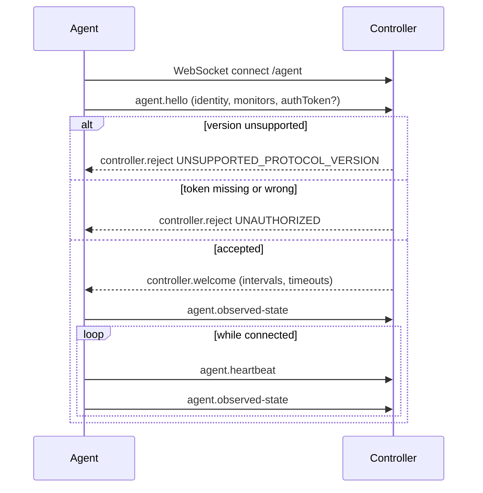

# Protocol

Two protocols live in `@desk-control/protocol`:

- the **agent protocol** — controller ↔ agents, over a LAN WebSocket
- the **client API** — UI clients ↔ controller, over HTTP + a WebSocket snapshot stream

Both are defined as Zod schemas and validated at the boundary. Types are inferred from the schemas,
so there is no way for the wire format and the TypeScript types to drift apart.

## Versioning

```ts
PROTOCOL_VERSION = 1;
MIN_SUPPORTED_PROTOCOL_VERSION = 1;
MAX_SUPPORTED_PROTOCOL_VERSION = 1;
```

Every frame carries `v`. The controller checks it **before** trusting anything else and rejects
out-of-range versions with `UNSUPPORTED_PROTOCOL_VERSION` — a silently mis-parsed DDC command is
worse than a refused connection.

Bump the version when an existing message changes meaning. Adding an optional field, or a new message
type that an older peer can ignore, does not need a bump.

## Envelope

```jsonc
{
  "v": 1,
  "messageId": "m3k1x-7", // unique per peer; used to correlate errors
  "sentAt": "2026-09-08T18:00:00.000Z",
  "type": "agent.command-result",
  "payload": {},
}
```

## Agent → Controller

| Type                   | Payload                                | Meaning                                     |
| ---------------------- | -------------------------------------- | ------------------------------------------- |
| `agent.hello`          | agent, computer, monitors, `authToken` | Registration. Must be the first frame.      |
| `agent.heartbeat`      | `uptimeSeconds`                        | Liveness.                                   |
| `agent.inventory`      | `monitors`                             | Re-discovery after a hotplug or on request. |
| `agent.observed-state` | `monitors`                             | What the hardware actually reports.         |
| `agent.command-ack`    | `commandId`                            | Received and starting work.                 |
| `agent.command-result` | `commandId`, `ok`, `error`, `observed` | Terminal outcome + a fresh reading.         |
| `agent.error`          | `code`, `message`, `relatedMessageId`  | Something was rejected.                     |

## Controller → Agent

| Type                           | Payload                                | Meaning                                  |
| ------------------------------ | -------------------------------------- | ---------------------------------------- |
| `controller.welcome`           | controller info, session id, intervals | Registration accepted.                   |
| `controller.reject`            | `code`, `message`                      | Registration refused; the socket closes. |
| `controller.ping`              | —                                      | Liveness probe.                          |
| `controller.command`           | `commandId`, `payload`, `deadlineAt`   | Do something to hardware.                |
| `controller.refresh-inventory` | —                                      | Re-discover and re-observe now.          |

## Registration



Any frame other than `agent.hello` before registration is answered with `UNKNOWN_AGENT` and the
socket closes. A reconnecting agent with an id that is already connected replaces its own old socket
rather than doubling up.

## Command lifecycle

```
pending ──► dispatched ──► acked ──► succeeded
   │            │            │  └──► failed
   │            │            └─────► timed-out
   └────────────┴──────────────────► superseded
```

- **Command ids are idempotency keys.** They may be generated by the client, the controller, or a
  retry. Re-issuing an id must never perform the action twice — the agent caches outcomes, and so
  does the simulated hardware.
- **Deadlines are on the wire.** `deadlineAt` travels with the command so the agent gives up on its
  own instead of leaving the controller to guess.
- **Newer intent wins.** A second request for the same target immediately marks the first
  `superseded`. Targets are keyed by `commandTargetKey()` — a monitor, or a switch channel.
- **A disconnect fails in-flight commands** (`DEVICE_UNREACHABLE`) but changes nothing about the
  hardware.

## Error codes

`INVALID_MESSAGE`, `UNSUPPORTED_PROTOCOL_VERSION`, `UNAUTHORIZED`, `UNKNOWN_AGENT`,
`UNKNOWN_COMMAND_KIND`, `UNKNOWN_TARGET`, `CAPABILITY_UNSUPPORTED`, `DEVICE_UNREACHABLE`,
`DEVICE_BUSY`, `TIMEOUT`, `SUPERSEDED`, `NO_CONTROL_PATH`, `INTERNAL`.

A closed set, so both sides branch on codes rather than string-matching messages. Provider-specific
strings are narrowed by `toProtocolErrorCode()`; anything unrecognised becomes `INTERNAL` rather than
leaking an unknown code across the boundary.

## Client API

| Method | Path                         | Body                                                   |
| ------ | ---------------------------- | ------------------------------------------------------ |
| `GET`  | `/api/health`                | —                                                      |
| `GET`  | `/api/desk`                  | — (returns a `DeskSnapshot`)                           |
| `POST` | `/api/desk/monitor-source`   | `{ monitorId, sourceComputerId, commandId? }`          |
| `POST` | `/api/desk/peripheral-owner` | `{ peripheralId, ownerComputerId, commandId? }`        |
| `POST` | `/api/desk/preset`           | `{ presetId }`                                         |
| `POST` | `/api/desk/name`             | `{ entityType, entityId, customName }` (`null` clears) |
| `GET`  | `/api/stream`                | WebSocket: `{ type: "snapshot", snapshot }`            |

Status codes: `400` malformed request, `409` valid request the desk cannot satisfy (not wired,
capability missing), `404` unknown entity.

**Whole snapshots, not patches.** The desk is tens of entities. Pushing the entire resolved state
removes a whole class of client/server drift bugs and means a phone, a browser and the Pi can never
disagree about what "switching" means. Bursts are coalesced into one frame per ~40 ms.

**Resolutions are computed server-side.** Clients render `status`, they do not derive it.

## Security

Today, honestly stated:

- The controller binds to `127.0.0.1` by default. Binding wider is opt-in and logs a warning when no
  token is set.
- `DESK_CONTROL_PAIRING_TOKEN`, when set, is a shared secret every agent must present in
  `agent.hello`. Mismatches are rejected with `UNAUTHORIZED`.
- Every frame is schema-validated before use. Unknown message types are rejected, not ignored.
- There is no transport encryption and no per-agent identity yet.

This is appropriate for a trusted home LAN and no more. **Do not expose the controller to the
internet.**

### The pairing design this is shaped to accept

The protocol already carries the fields needed for a proper scheme, so adding it needs no version
bump:

1. **Trust on first use with confirmation.** A new agent's `hello` puts it in a pending list. The
   touchscreen shows the agent name and a short code derived from its public key; the user taps
   approve. Approved agents are stored in config with their key fingerprint.
2. **Per-agent keys, not a shared secret.** Each agent generates an Ed25519 keypair on first run and
   signs a challenge from `controller.welcome`. `authToken` becomes a signature rather than a
   password, which removes the "one leaked token owns the desk" failure mode.
3. **Transport.** Self-signed TLS with the controller's certificate fingerprint pinned during
   pairing — enough to stop passive LAN observation without operating a CA.
4. **Client auth.** UI clients get the same treatment; the Pi is paired at install time.

Deliberately out of scope: a real PKI, revocation infrastructure, or any cloud identity.
